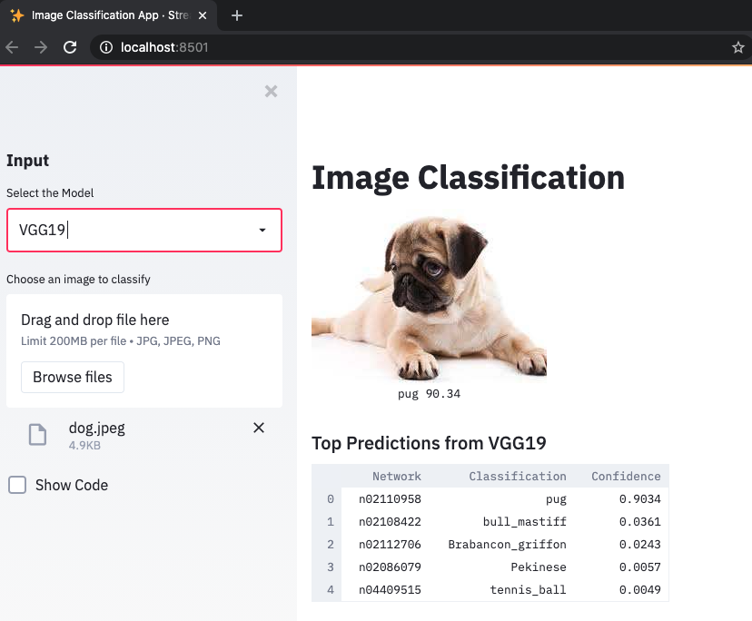
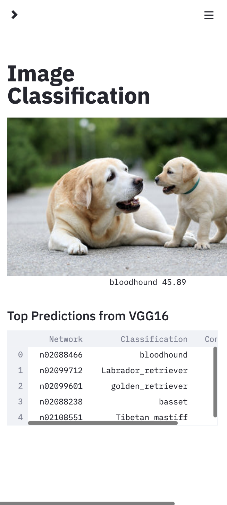

# streamlit-ml-demo
A demo application to showcase the responsive UI for ImageNet using Streamlit. Streamlit provides an alternative to building full stack applications for the Machine Learning interface. Here, streamlit is used to upload an image for inference from the model.

This demo is created using [Streamlit](https://www.streamlit.io/).

The ImageNet model [code](classify_image.py) using TensorFlow has been adapted from [PyImageSearch](https://www.pyimagesearch.com/2017/03/20/imagenet-vggnet-resnet-inception-xception-keras/)

### How to Run?
Install the requirements

``pip install -r requirements.txt``

Run the application

``streamlit run ml_frontend.py``

The application will run on localhost:8501 by default.

### Sample Screenshots

